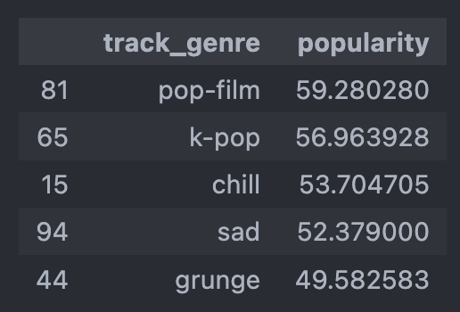
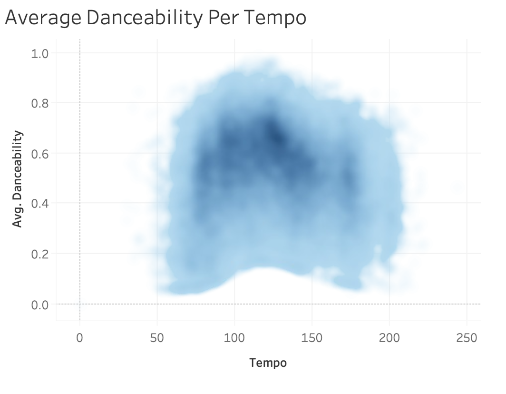

# Project
- [Project](#project)
  - [Overview](#overview)
    - [What are we going to look at?](#what-are-we-going-to-look-at)
    - [Why are these important?](#why-are-these-important)
  - [Data](#data)
    - [Source](#source)
      - [What do we care about?](#what-do-we-care-about)
  - [Data](#data-1)
      - [What is the most popular music?](#what-is-the-most-popular-music)
      - [What is the most popular danceability?](#what-is-the-most-popular-danceability)
      - [What is the most danceable tempo?](#what-is-the-most-danceable-tempo)
  - [Conclusions](#conclusions)

## Overview
In this project we are going to look at a dataset of over 100000 songs taken directly from the Spotify API and attempt to draw connections on what makes a song the most popular. (Keep in mind this is based off of spotify's popularity metric)

### What are we going to look at?
* We're going to take a look at the genres with the highest popularity rating.
* We're going to look at how danceable a song should be to be at peak popularity rating.
* We're going to look at what tempo makes the most danceable song.

### Why are these important?
It is important to look at metrics provided to us through Spotify's API in order to see what creates a "popular" song so studios or independent artists can spend more of their time working on songs with these parameters and increase their chances of making the next "hit" song.

## Data

### Source
The data is sourced from https://www.kaggle.com/datasets/maharshipandya/-spotify-tracks-dataset which is taken directly from calls to the Spotify API.

Here are the column descriptions taken directly from the kaggle source.

**Column Description**
- track_id: The Spotify ID for the track
- artists: The artists' names who performed the track. If there is more than one artist, they are separated by a ;
- album_name: The album name in which the track appears
- track_name: Name of the track
- popularity: The popularity of a track is a value between 0 and 100, with 100 being the most popular. The popularity is calculated by algorithm and is based, in the most part, on the total number of plays the track has had and how recent those plays are. Generally speaking, songs that are being played a lot now will have a higher popularity than songs that were played a lot in the past. Duplicate tracks (e.g. the same track from a single and an album) are rated independently. Artist and album popularity is derived mathematically from track popularity.
- duration_ms: The track length in milliseconds
- explicit: Whether or not the track has explicit lyrics (true = yes it does; false = no it does not OR unknown)
- danceability: Danceability describes how suitable a track is for dancing based on a combination of musical elements including tempo, rhythm stability, beat strength, and overall regularity. A value of 0.0 is least danceable and 1.0 is most danceable
- energy: Energy is a measure from 0.0 to 1.0 and represents a perceptual measure of intensity and activity. Typically, energetic tracks feel fast, loud, and noisy. For example, death metal has high energy, while a Bach prelude scores low on the scale
- key: The key the track is in. Integers map to pitches using standard Pitch Class notation. E.g. 0 = C, 1 = C♯/D♭, 2 = D, and so on. If no key was detected, the value is -1
- loudness: The overall loudness of a track in decibels (dB)
- mode: Mode indicates the modality (major or minor) of a track, the type of scale from which its melodic content is derived. Major is represented by 1 and minor is 0
- speechiness: Speechiness detects the presence of spoken words in a track. The more exclusively speech-like the recording (e.g. talk show, audio book, poetry), the closer to 1.0 the attribute value. Values above 0.66 describe tracks that are probably made entirely of spoken words. Values between 0.33 and 0.66 describe tracks that may contain both music and speech, either in sections or layered, including such cases as rap music. Values below 0.33 most likely represent music and other non-speech-like tracks
- acousticness: A confidence measure from 0.0 to 1.0 of whether the track is acoustic. 1.0 represents high confidence the track is acoustic
- instrumentalness: Predicts whether a track contains no vocals. "Ooh" and "aah" sounds are treated as instrumental in this context. Rap or spoken word tracks are clearly "vocal". The closer the instrumentalness value is to 1.0, the greater likelihood the track contains no vocal content
- liveness: Detects the presence of an audience in the recording. Higher liveness values represent an increased probability that the track was performed live. A value above 0.8 provides strong likelihood that the track is live
- valence: A measure from 0.0 to 1.0 describing the musical positiveness conveyed by a track. Tracks with high valence sound more positive (e.g. happy, cheerful, euphoric), while tracks with low valence sound more negative (e.g. sad, depressed, angry)
- tempo: The overall estimated tempo of a track in beats per minute (BPM). In musical terminology, tempo is the speed or pace of a given piece and derives directly from the average beat duration
- time_signature: An estimated time signature. The time signature (meter) is a notational convention to specify how many beats are in each bar (or measure). The time signature ranges from 3 to 7 indicating time signatures of 3/4, to 7/4.
- track_genre: The genre in which the track belongs

#### What do we care about?
The columns that we direclty care about are the following columns:
- track_id
- track_name
- artists
- track_genre
- popularity
- danceability
- tempo

## Data
#### What is the most popular music?

#### What is the most popular danceability?

The most popular danceability looks to be 0.6-0.65.

#### What is the most danceable tempo?

The most danceable tempo, following the trend and desnity, looks to be around 125 BPM.

## Conclusions

In order to make the most likely to be popular song, you should: 
- create either a movie featured pop song or kpop
- create a song with a danceability of around 0.6
- create a song with a tempo between 100 BPM and 150 BPM to achieve ideal danceability.